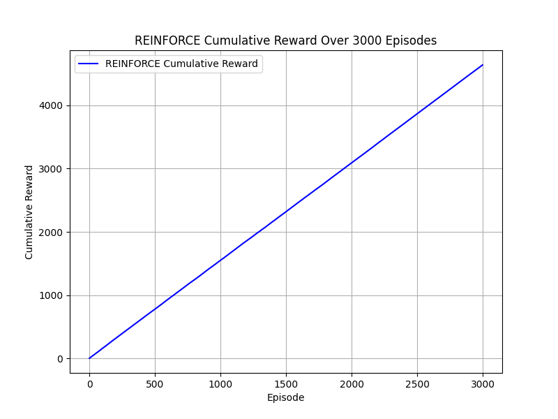
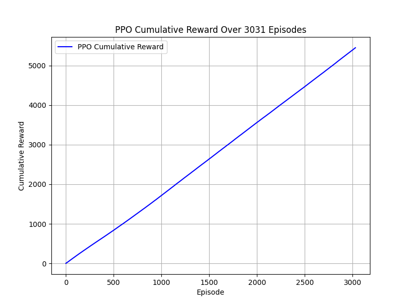
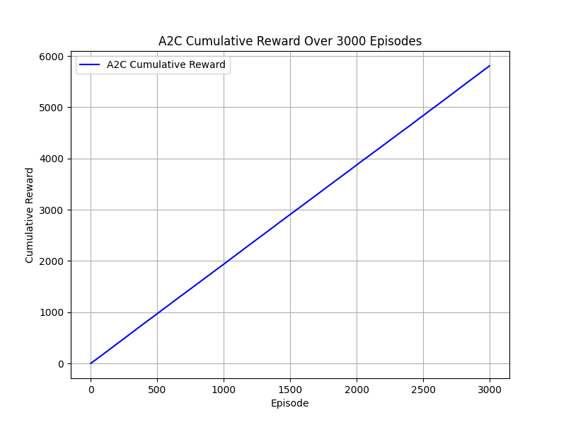
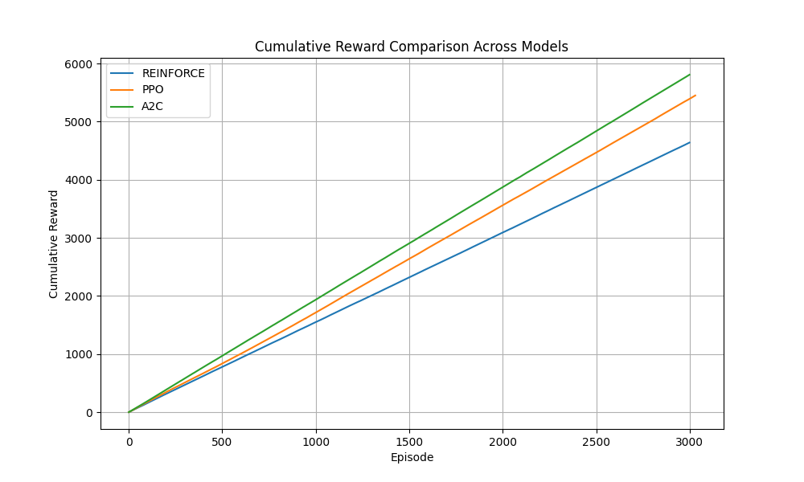
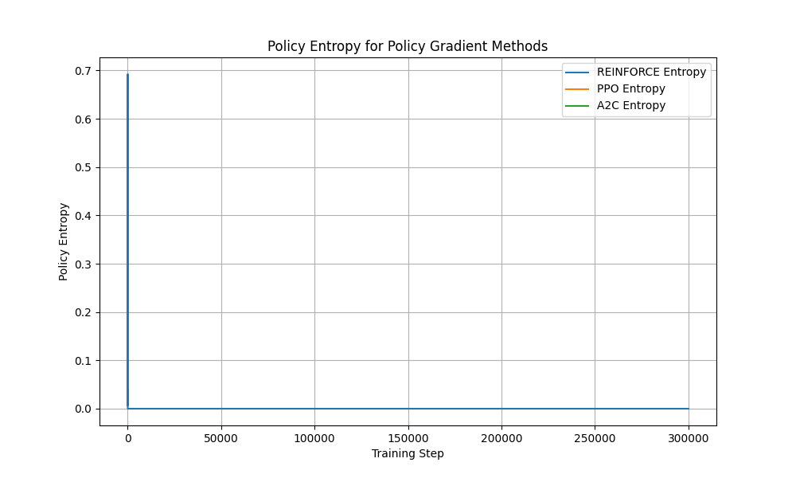

# RL Trading Agent Metric Analysis

## Cumulative Reward Analysis
Below are the cumulative reward plots for each model over training episodes. The random agent is excluded as it does not learn, and its visualization (`random_agent.gif`) omits cumulative reward in the Portfolio Panel to reflect pre-training behavior.

### Combined Cumulative Reward

## Objective Function and Policy Entropy

## Performance on Unseen Initial States
Models were tested on 10 episodes with unseen initial conditions (prices in [100, 200], shares in [20, 80], altered correlation matrix).
| Model | Avg Reward | Avg Growth (%) |
|-------|------------|----------------|
| REINFORCE | 0.05 | 420.9% |
| DQN | 0.01 | 425.8% |
| PPO | 0.01 | 442.1% |
| A2C | 0.02 | 475.6% |

## Episodes to Stable Performance
Stability is defined as the mean reward over 5 consecutive episodes being within 5% of the final mean reward (average of last 5 episodes).

| Model | Stable Episode | Mean Reward | Std Reward |
|-------|----------------|-------------|------------|
| REINFORCE | 6 | 1.61 | 0.06 |
| PPO | 41 | 1.89 | 0.05 |
| A2C | 15 | 1.95 | 0.23 |
